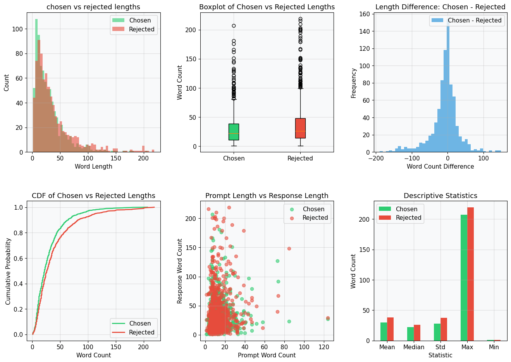
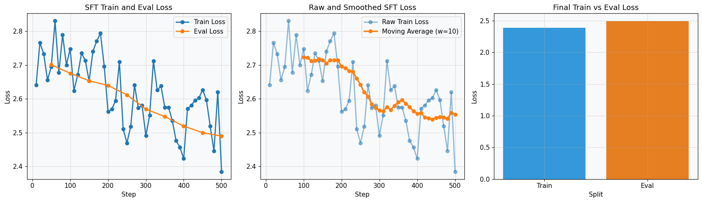
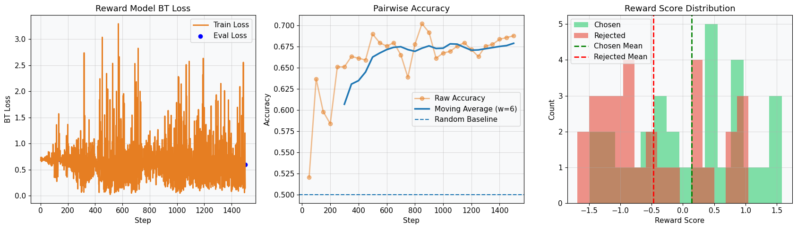
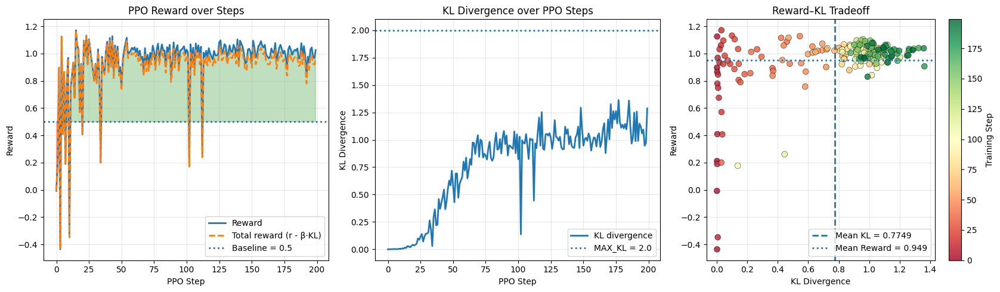
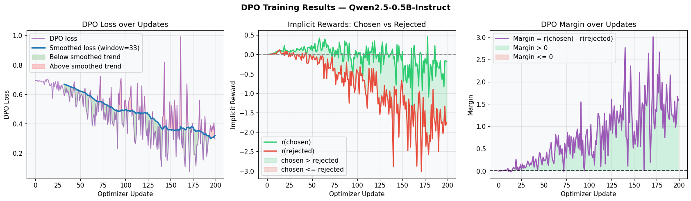
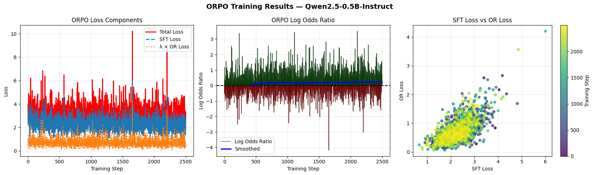
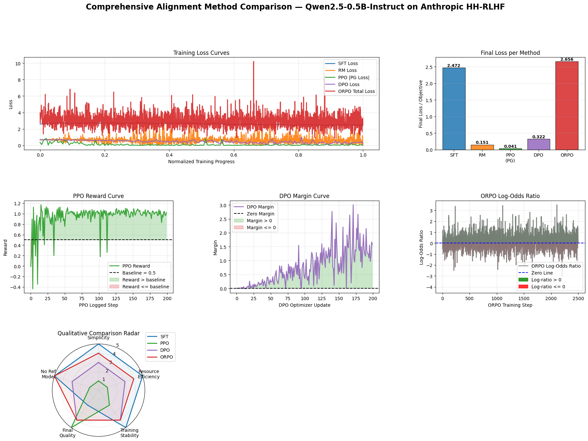
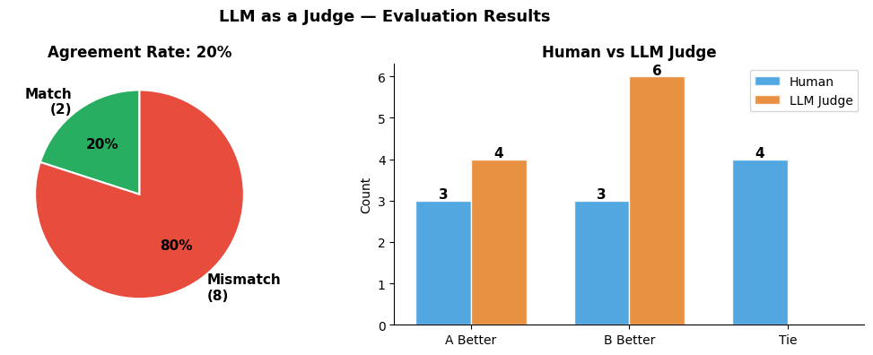

# LLM Alignment and Preference Optimization

A practical implementation and comparison of several post-training alignment techniques for large language models, including **Supervised Fine-Tuning (SFT)**, **Reward Modeling**, **Proximal Policy Optimization (PPO)**, **Direct Preference Optimization (DPO)**, **Odds Ratio Preference Optimization (ORPO)**, and **LLM-as-a-Judge evaluation**.

The experiments use **Qwen2.5-0.5B-Instruct** and preference data derived from **Anthropic HH-RLHF** to study how different alignment objectives affect optimization behavior and preference separation.

---

## Overview

Modern LLM alignment methods attempt to make model behavior better reflect human preferences after pretraining.

This project implements several major alignment approaches in a common experimental pipeline:

- **Supervised Fine-Tuning (SFT)** on preferred responses
- **Pairwise Reward Modeling** using Bradley-Terry loss
- **PPO** with reward-model feedback and KL regularization
- **DPO** using direct preference optimization against a frozen reference model
- **ORPO** combining supervised learning and preference optimization in a single model
- **LLM as a Judge** for pairwise response evaluation

The notebook includes data preprocessing, training loops, checkpoint management, diagnostic visualizations, qualitative generation comparisons, and cross-method analysis.

---

## Alignment Pipeline

```text
Base Model
   │
   ├── Supervised Fine-Tuning (SFT)
   │        │
   │        └── SFT Checkpoint
   │              │
   │              ├── Reward Model
   │              │       │
   │              │       └── PPO Reward Signal
   │              │
   │              ├── PPO Policy + Frozen Reference
   │              │
   │              └── DPO Policy + Frozen Reference
   │
   └── ORPO
        └── Joint SFT + Preference Optimization
```

The methods intentionally use different optimization objectives, so their raw loss values should not be interpreted as directly comparable measures of final model quality.

---

## Methods

### Supervised Fine-Tuning

The base model is fine-tuned on the preferred (`chosen`) responses from the preference dataset.

Training is performed using TRL's `SFTTrainer`, and both training and evaluation losses are tracked throughout optimization.

The resulting SFT model is used as the initialization for later alignment stages such as reward modeling, PPO, and DPO.

---

### Reward Modeling

A scalar reward model is trained using pairwise human preferences.

For each chosen–rejected pair, the model optimizes the Bradley-Terry objective:

```math
\mathcal{L}_{BT}
=
-\log \sigma(r_{\text{chosen}} - r_{\text{rejected}})
```

The implementation includes:

- Dynamic batch padding
- L2 regularization on reward scores
- Gradient accumulation
- Gradient clipping
- Linear learning-rate scheduling
- Best-model selection using pairwise evaluation accuracy

The trained reward model is later frozen and used as the reward signal for PPO.

---

### Proximal Policy Optimization

PPO further aligns the SFT model using feedback from the trained reward model.

The implementation includes:

- Clipped policy-ratio objective
- KL regularization against a frozen SFT reference model
- EMA reward baseline
- Gradient clipping
- Hard KL threshold for skipping overly divergent updates

The objective balances reward improvement against excessive policy drift.

---

### Direct Preference Optimization

DPO removes the need for an explicit reward model and directly optimizes the policy using chosen and rejected responses.

The policy and frozen reference model are both initialized from the SFT checkpoint.

The DPO objective encourages the policy to increase the relative likelihood of preferred responses:

```math
\mathcal{L}_{DPO}
=
-\log \sigma
\left(
\beta
\left[
\log \frac{\pi_\theta(y_w \mid x)}
{\pi_{\text{ref}}(y_w \mid x)}
-
\log \frac{\pi_\theta(y_l \mid x)}
{\pi_{\text{ref}}(y_l \mid x)}
\right]
\right)
```

Response-only log-probabilities are used so that prompt tokens do not contribute to the preference objective.

---

### Odds Ratio Preference Optimization

ORPO performs supervised learning and preference optimization using a **single trainable model**, without a frozen reference model.

The total objective combines supervised response modeling with an odds-ratio preference term:

```math
\mathcal{L}_{ORPO}
=
\mathcal{L}_{SFT}
+
\lambda \mathcal{L}_{OR}
```

The implementation uses:

- Response-only supervised cross-entropy
- Average response log-probabilities
- Chosen–rejected log-odds comparison
- Dynamic mini-batch padding
- Gradient clipping
- Linear learning-rate scheduling

Unlike DPO, ORPO performs both supervised adaptation and preference optimization jointly.

---

## Experimental Results

### Exploratory Data Analysis

The preference dataset shows substantial overlap between chosen and rejected response lengths.

Rejected responses are somewhat longer and more variable on average, but response length alone is not sufficient to explain human preference labels.



---

### Supervised Fine-Tuning

The SFT training and evaluation losses decrease throughout optimization.

The smoothed training trajectory shows consistent convergence while the train–evaluation gap remains relatively small.



---

### Reward Model

The reward model learns a meaningful pairwise preference signal and performs substantially above the random 50% ranking baseline during evaluation.

Chosen responses also receive higher average reward scores than rejected responses, although the two distributions remain partially overlapping.



---

### PPO

PPO rapidly improves reward-model scores while KL divergence from the frozen SFT reference increases gradually.

In the recorded run:

- Mean reward: approximately **0.95**
- Mean KL divergence: approximately **0.77**
- KL remained below the configured hard limit of `2.0`

The results indicate a favorable reward–divergence tradeoff for this experiment.



---

### DPO

DPO produces strong preference separation during training.

Key observations from the recorded run include:

- Final preference margin: approximately **1.58**
- Mean preference margin: approximately **0.75**
- Mean margin over the final 20 updates: approximately **1.39**
- Positive preference margin in approximately **97%** of optimizer updates
- Mean DPO loss decreased substantially toward the end of training

The increasing chosen–rejected margin indicates that the policy progressively learns to favor preferred responses relative to the SFT reference model.



---

### ORPO

ORPO also learns a positive preference signal, although its preference separation is noisier than DPO in this experiment.

Approximately **61.9%** of recorded training steps produce a positive chosen–rejected log-odds ratio.

The final training region shows a moderately positive preference signal while simultaneously optimizing the supervised response objective.



---

## Cross-Method Comparison

The final dashboard compares optimization behavior across SFT, reward modeling, PPO, DPO, and ORPO.

Because these methods optimize fundamentally different objectives, their numerical loss values are shown only as training diagnostics and should not be interpreted as directly comparable model-quality scores.

The qualitative comparison highlights several tradeoffs:

- **SFT** is simple and stable but does not explicitly optimize pairwise preferences.
- **PPO** can achieve strong reward improvement but requires a reward model, frozen reference model, and more complex training.
- **DPO** provides strong preference separation without training a separate reward model.
- **ORPO** removes the reference-model requirement and jointly performs supervised and preference optimization.



---

## Qualitative Generation Comparison

The SFT, DPO, and ORPO models are also evaluated on the same held-out prompt using identical stochastic decoding settings.

This allows qualitative inspection of how different alignment objectives influence generated responses.

The comparison is intended as a diagnostic rather than a quantitative benchmark.

---

## LLM as a Judge

The project also explores **LLM-based pairwise evaluation** using human-labeled MT-Bench comparisons.

The judge receives:

- A user question
- Response A
- Response B

and must return one of:

```text
A
B
tie
```

The predicted verdict is then compared with the normalized human preference label.

### Human Agreement

On a reproducible 10-example evaluation sample:

- Human–judge agreement: **20%**
- Matching judgments: **2 / 10**
- Human ties: **4**
- Judge-predicted ties: **0**

The judge therefore shows poor agreement with human preferences in this small diagnostic sample and exhibits a tendency to choose one of the two responses rather than predicting a tie.



### Position Bias

The judge is additionally evaluated by swapping the positions of candidate responses.

Across five tested comparisons:

- Consistency rate: **0%**
- Position-sensitive cases: **5 / 5**

The judge repeatedly preserved its positional verdict instead of reversing the preference after the answers were swapped.

This small-sample experiment demonstrates why LLM-as-a-Judge systems should be validated for systematic biases rather than treated as automatically reliable evaluators.

---

## Repository Structure

```text
llm-alignment-and-preference-optimization/
├── alignment/
│   └── llm_alignment_methods.ipynb
│
├── assets/
│   ├── dpo_results.png
│   ├── eda_analysis.png
│   ├── final_comparison.png
│   ├── llm_judge_results.png
│   ├── orpo_results.png
│   ├── ppo_results.png
│   ├── rm_results.png
│   └── sft_results.png
│
├── data/
│   ├── Alignment_dataset.xlsx
│   └── LLM_judge_dataset.xlsx
│
├── .env.example
├── .gitignore
├── README.md
└── requirements.txt
```

Model checkpoints and intermediate training outputs are intentionally excluded from version control.

---

## Setup

Clone the repository and install the dependencies:

```bash
git clone https://github.com/Hamidreza-Talei/decoder-only-transformer-from-scratch/edit/main/README.md
cd llm-alignment-and-preference-optimization

python -m venv venv
source venv/bin/activate

pip install -r requirements.txt
```

On Windows:

```bash
venv\Scripts\activate
```

Then open:

```text
alignment/llm_alignment_methods.ipynb
```

and execute the notebook sequentially.

A CUDA-capable GPU is recommended for the training experiments.

---

## Data

The repository includes local copies of the datasets required by the notebook:

```text
data/Alignment_dataset.xlsx
data/LLM_judge_dataset.xlsx
```

The alignment pipeline can load Anthropic HH-RLHF from the Hugging Face Hub when available and use the local alignment dataset as a fallback.

The LLM-as-a-Judge experiment uses the included local MT-Bench human-judgment subset to keep the evaluation reproducible across runs.

---

## Model Checkpoints

Training stages create local checkpoints such as:

```text
qwen_sft_checkpoint/
qwen_reward_checkpoint/
qwen_ppo_checkpoint/
qwen_dpo_checkpoint/
qwen_orpo_checkpoint/
```

These directories are excluded through `.gitignore` because model weights are large and can be regenerated by running the notebook.

The checkpoints also store training histories used by later comparison stages.

---

## Key Takeaways

This project illustrates several practical differences between alignment strategies:

- **SFT** provides a stable supervised starting point.
- **Reward modeling** learns an explicit scalar representation of human preference.
- **PPO** directly optimizes model behavior against that reward signal while constraining policy drift.
- **DPO** learns pairwise preferences directly and produced the strongest preference separation in this experiment.
- **ORPO** combines supervised and preference optimization without requiring a reference model.
- **LLM-as-a-Judge** can provide scalable automated evaluation, but the experiments here demonstrate that judge agreement and position bias must be validated carefully.

No single training objective should be considered universally superior based only on its training loss. Reliable comparison requires shared downstream evaluation criteria and, ideally, larger human or independent evaluation sets.